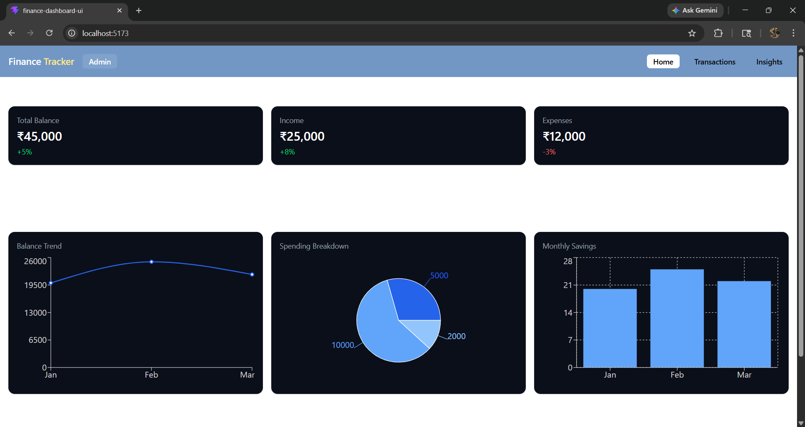
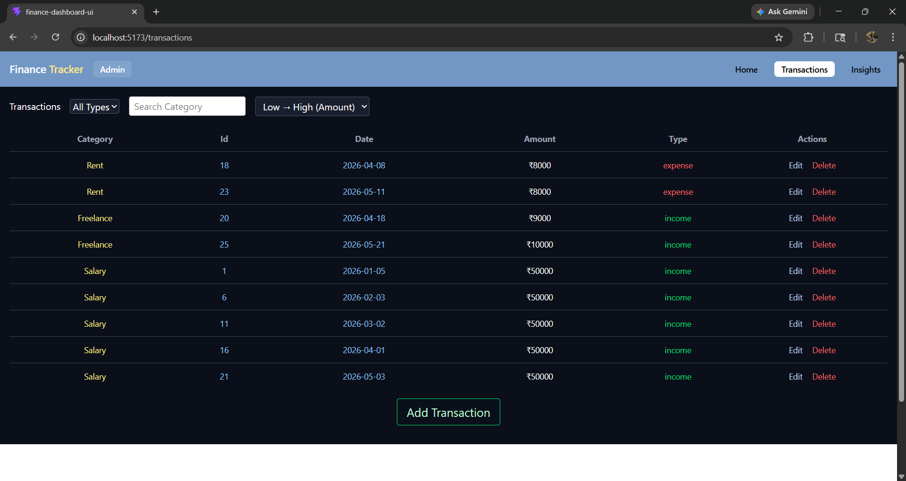
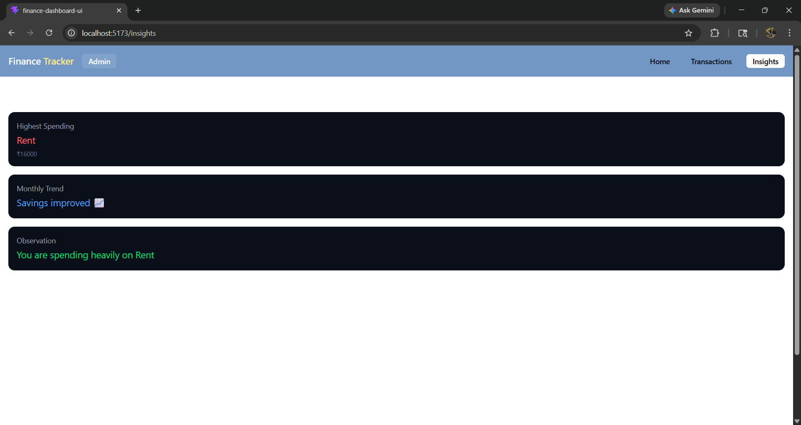

# 💰 Finance Dashboard

A modern and responsive **Finance Dashboard** built using React that allows users to manage transactions, visualize financial data, and gain meaningful insights into their spending behavior.

---

## 🚀 Features

### 📊 Dashboard

* Summary cards (Total Balance, Income, Expenses)
* Interactive charts using Recharts

  * Balance trend (time-based)
  * Category-wise spending breakdown
  * Monthly savings visualization

### 💳 Transactions

* View all transactions in a table
* Add new transactions via modal form (Admin only)
* Delete transactions (Admin only)
* Search by category
* Filter by income/expense
* Sort by amount

### 🔐 Role-Based UI (Frontend Simulation)

* **Admin**

  * Add / Delete/ Edit transactions
* **Viewer**

  * View-only access

### 📈 Insights Page

* Highest spending category
* Monthly savings comparison
* Smart observations based on data

---

## 🛠️ Tech Stack

* **Frontend:** React.js
* **Styling:** Tailwind CSS
* **Charts:** Recharts
* **State Management:** React Hooks (useState)

---

## 📦 Installation & Setup

```bash
# Clone the repository
git clone https://github.com/sparkingbeard/Finance-Dashboard-Project

# Navigate into project
cd FINANCE DASHBOARD UI

# Install dependencies
npm install

# Run the app
npm run dev
```

---

## 💡 How to Use

* Add transactions using the **Add Transaction** button (Admin only)
* Use filters to view **Income / Expense**
* Search transactions by category
* Sort transactions based on amount
* Switch roles to see different UI behavior
* Visit the **Insights page** to analyze spending patterns

---

## 📊 Example Insights

* 🔥 Highest Spending Category: Rent
* 📈 Monthly Trend: Savings improved
* 💡 Observation: You are spending heavily on Rent

---

## 🎯 Key Concepts Used

* Component-based architecture
* Reusable UI components (cards, tables, forms)
* Conditional rendering (RBAC)
* Data transformation (filter, map, reduce)
* Responsive design using Tailwind

---

## 🔮 Future Improvements

* ✏️ Edit transaction functionality
* 🔐 Backend integration (Spring Boot / Node.js)
* 🔑 Authentication & authorization
* 📤 Export data (CSV/PDF)
* 📱 Improved mobile UI (card-based transactions)

---

## 📸 Screenshots

### 📊 Dashboard


### 💳 Transactions


### 📈 Insights


## 👨‍💻 Author

**Tushar Bisen**

---

## ⭐ If you like this project

Give it a star on GitHub ⭐
